# Project Aether System Architecture

## Overview

Project Aether is built on a decoupled service-oriented architecture designed for scalability, maintainability, and reliability. The system leverages AWS managed services and follows cloud-native best practices for a production-ready SEO intelligence platform.

## Architecture Diagram

```mermaid
graph TB
    %% Frontend Layer
    subgraph "Frontend - React SPA"
        UI[React 18+ with TypeScript]
        UI --> |State Management| ZS[Zustand Store]
        UI --> |Data Fetching| TQ[TanStack Query]
        UI --> |UI Components| SC[Shadcn/UI + Tailwind CSS]
        UI --> |Data Viz| RC[Recharts]
    end
    
    %% API Gateway
    subgraph "API Layer - AWS App Runner"
        API[FastAPI Backend]
        API --> |Validation| PY[Pydantic V2]
        API --> |Auth| JWT[JWT Authentication]
        API --> |Password Hash| BC[Bcrypt Security]
        API --> |ORM| SQL[SQLAlchemy 2.0]
        API --> |Business Logic| SL[Service Layer]
    end
    
    %% Service Layer
    subgraph "Service Layer - Business Logic"
        SL --> |AI Operations| AIS[AI Service]
        SL --> |External APIs| EAS[External API Service]
        SL --> |Task Management| TS[Task Service]
        AIS --> |Prompt Management| PM[Prompt Manager]
        EAS --> |Caching| CC[Cache Controller]
    end
    
    %% Worker Layer
    subgraph "Async Workers - AWS ECS Fargate"
        WORKER[Celery Workers]
        WORKER --> |Web Crawling| SCRAPY[Scrapy + Playwright]
        WORKER --> |AI Processing| AI[AI Service Module]
        WORKER --> |External APIs| EXT[External API Services]
    end
    
    %% Data Layer
    subgraph "Data Storage"
        DB[(PostgreSQL 15+<br/>AWS RDS)]
        CACHE[(Redis<br/>AWS ElastiCache)]
    end
    
    %% External Services
    subgraph "External Integrations"
        BEDROCK[AWS Bedrock<br/>Foundation Models]
        PAGESPEED[Google PageSpeed<br/>Insights API]
        DATAFORSEO[DataForSEO<br/>API]
        BACKLINK[Backlink Provider<br/>API]
    end
    
    %% Security Layer
    SECRETS[AWS Secrets Manager]
    
    %% Connections
    UI -.->|HTTPS| API
    API --> DB
    API --> CACHE
    API --> |Enqueue Tasks| CACHE
    AIS --> BEDROCK
    AIS --> PM
    EAS --> PAGESPEED
    EAS --> DATAFORSEO
    EAS --> BACKLINK
    EAS --> CC
    CC --> CACHE
    TS --> CACHE
    WORKER --> |Read Tasks| CACHE
    WORKER --> DB
    WORKER --> AIS
    WORKER --> EAS
    API --> SECRETS
    WORKER --> SECRETS
    
    %% Styling
    classDef frontend fill:#e3f2fd,stroke:#1976d2,stroke-width:2px
    classDef backend fill:#f3e5f5,stroke:#7b1fa2,stroke-width:2px
    classDef service fill:#e8f5e9,stroke:#388e3c,stroke-width:2px
    classDef worker fill:#fff3e0,stroke:#f57c00,stroke-width:2px
    classDef database fill:#e0f7fa,stroke:#00796b,stroke-width:2px
    classDef external fill:#fce4ec,stroke:#c2185b,stroke-width:2px
    classDef security fill:#ffebee,stroke:#d32f2f,stroke-width:2px
    
    class UI,ZS,TQ,SC,RC frontend
    class API,PY,JWT,BC,SQL backend
    class SL,AIS,EAS,TS,PM,CC service
    class WORKER,SCRAPY,AI,EXT worker
    class DB,CACHE database
    class BEDROCK,PAGESPEED,DATAFORSEO,BACKLINK external
    class SECRETS security
```

## Component Details

### Frontend Layer
- **React SPA**: Single Page Application built with React 18+ and TypeScript
- **Vite**: Lightning-fast build tool for development and production builds
- **Zustand**: Lightweight state management for global application state
- **TanStack Query**: Server state management with caching and background refetching
- **Shadcn/UI + Tailwind CSS**: Modern, accessible UI components with utility-first styling

### API Layer (AWS App Runner)
- **FastAPI**: High-performance async Python web framework
- **Pydantic V2**: Data validation and serialization
- **SQLAlchemy 2.0**: Async ORM with asyncpg driver
- **JWT Authentication**: Secure token-based authentication with AWS Secrets Manager
- **Bcrypt Security**: Password hashing with salt generation and timing attack protection
- **Auto-scaling**: Managed by AWS App Runner based on traffic
- **Service Layer Integration**: Clean separation of concerns with dedicated business logic layer

### Service Layer (Business Logic)
- **AI Service**: AWS Bedrock integration for Claude model interactions
  - Claude 3 Haiku/Sonnet/Opus model support
  - Comprehensive error handling and retry logic
  - Intelligent model selection for cost optimization
- **External API Service**: Unified gateway for third-party integrations
  - Google PageSpeed Insights integration
  - SERP data and keyword intelligence
  - Backlink analysis and competitor research
  - Intelligent Redis caching for cost control
- **Task Service**: Celery task management and orchestration
  - Long-running site crawl operations
  - Performance analysis and reporting
  - AI-powered content brief generation
- **Prompt Manager**: Centralized prompt template management
  - Version-controlled prompt library
  - Dynamic prompt parameterization
  - SEO-focused prompt templates
- **Cache Controller**: Intelligent caching strategy
  - Multi-level caching with TTL management
  - Cost optimization through cache hit maximization
  - Performance monitoring and statistics

### Async Workers (AWS ECS Fargate)
- **Celery**: Distributed task queue for long-running operations
- **Scrapy + Playwright**: JavaScript-aware web crawler for site audits
- **AI Service Module**: Interface to AWS Bedrock for LLM operations
- **External API Services**: Integrations with third-party SEO data providers

### Data Storage
- **PostgreSQL 15+ (AWS RDS)**: Primary relational database with JSONB support
- **Redis (AWS ElastiCache)**: Message broker for Celery and application cache

### External Integrations
- **AWS Bedrock**: Access to foundation models (Claude 3 Haiku/Sonnet)
- **Google PageSpeed Insights**: Core Web Vitals and performance metrics
- **DataForSEO**: SERP data and keyword intelligence
- **Backlink Provider**: Third-party backlink analysis (Ahrefs/Semrush/DataForSEO)

### Security
- **AWS Secrets Manager**: Centralized secret storage for JWT secrets, API keys, and credentials
- **JWT Authentication**: Stateless token-based authentication with 24-hour expiration
- **Password Security**: Bcrypt hashing with automatic salt generation
- **IAM Roles**: Least-privilege access control for all AWS services
- **VPC**: Private network isolation for database and internal services
- **OWASP Compliance**: Protection against OWASP Top 10 vulnerabilities

## Data Flow

1. **User Interaction**: User interacts with the React SPA
2. **API Request**: Frontend sends HTTPS request to FastAPI backend
3. **Authentication**: JWT token validated on protected endpoints using AWS Secrets Manager
4. **Authorization**: User permissions checked based on token claims
5. **Service Layer Routing**: API routes requests to appropriate service components
6. **Business Logic Processing**: Services handle domain-specific operations
7. **Synchronous Operations**: Quick operations handled directly by services
8. **Asynchronous Operations**: Long-running tasks enqueued via Task Service
9. **Worker Processing**: Celery workers pick up tasks from queue
10. **Service Integration**: Workers utilize AI and External API services
11. **External Data**: External API Service fetches data with intelligent caching
12. **AI Processing**: AI Service invokes Bedrock models for AI features
13. **Result Storage**: Results stored in PostgreSQL with cache updates
14. **Cache Optimization**: Cache Controller manages multi-level caching strategy
15. **Response**: API returns data or task ID to frontend
16. **UI Update**: Frontend updates based on response or polls for task status

## Service Layer Architecture

### Design Patterns
- **Service Layer Pattern**: Clean separation of business logic from API controllers
- **Dependency Injection**: Services injected into API endpoints for testability
- **Interface Segregation**: Focused, single-purpose service interfaces
- **Single Responsibility**: Each service handles one specific domain

### Service Benefits
- **Maintainability**: Business logic centralized and easier to modify
- **Testability**: Services can be unit tested in isolation
- **Reusability**: Services can be consumed by multiple API endpoints
- **Scalability**: Services can be independently optimized and scaled

### Integration Patterns
- **Circuit Breaker**: Graceful degradation for external service failures
- **Retry Logic**: Intelligent retry strategies for transient failures
- **Caching Strategy**: Multi-level caching for performance optimization
- **Error Handling**: Comprehensive error handling with structured logging

## Scalability Considerations

- **Horizontal Scaling**: App Runner and ECS Fargate scale containers automatically
- **Service Scaling**: Individual services can be optimized and scaled independently
- **Database Connection Pooling**: SQLAlchemy configured with asyncpg for efficient connections
- **Intelligent Caching**: Service-level caching reduces database load and external API calls
- **Task Distribution**: Celery distributes work across multiple worker containers
- **CDN Integration**: Static assets served via CloudFront (future enhancement)

## Monitoring & Observability

- **AWS CloudWatch**: Centralized logging and metrics
- **Structured Logging**: JSON-formatted logs for easy parsing
- **Performance Metrics**: API latency, task duration, error rates
- **Alerts**: CloudWatch alarms for critical issues