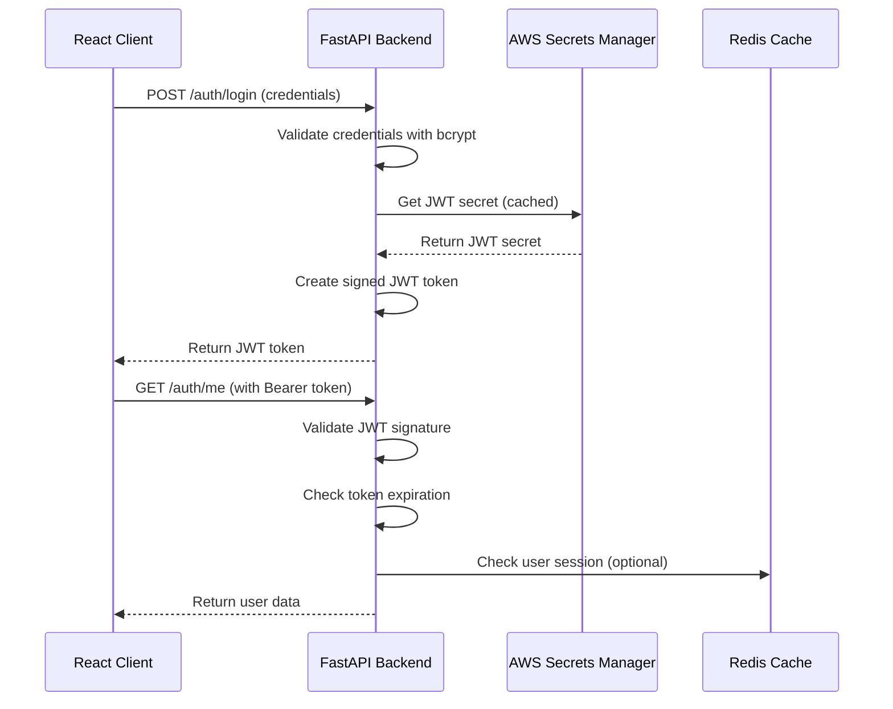

# Authentication & Security Documentation

**Project:** Project Aether  
**Version:** 1.0.0  
**Last Updated:** 2025-07-03  

## 🔐 Overview

This document provides comprehensive security documentation for the Project Aether authentication system, covering implementation details, security measures, threat mitigation strategies, and operational procedures.

## 📋 Table of Contents

1. [Authentication Architecture](#authentication-architecture)
2. [Security Features](#security-features)
3. [OWASP Top 10 Mitigation](#owasp-top-10-mitigation)
4. [Threat Model](#threat-model)
5. [Security Configuration](#security-configuration)
6. [Operational Security](#operational-security)
7. [Incident Response](#incident-response)
8. [Compliance & Auditing](#compliance--auditing)

## 🏗️ Authentication Architecture

### Authentication Flow



### Component Security Model

| Component | Security Measures | Threat Mitigation |
|-----------|------------------|-------------------|
| **Password Storage** | Bcrypt hashing, automatic salt | Rainbow table attacks, password dumps |
| **JWT Tokens** | HS256 signatures, expiration | Token forgery, indefinite sessions |
| **Secret Management** | AWS Secrets Manager, IAM roles | Secret exposure, credential rotation |
| **API Endpoints** | OAuth2 Bearer tokens, validation | Unauthorized access, session hijacking |
| **Error Handling** | Generic error messages | Information disclosure, enumeration |

## 🛡️ Security Features

### Password Security

#### Bcrypt Implementation
```python
# Password hashing configuration
pwd_context = CryptContext(schemes=["bcrypt"], deprecated="auto")

# Security features:
# - Adaptive hashing (configurable cost factor)
# - Automatic salt generation (unique per password)
# - Constant-time verification (timing attack protection)
# - Future-proof algorithm migration support
```

#### Password Policy
- **Minimum Length**: 8 characters
- **Complexity**: Enforced at application level
- **Storage**: Never stored in plain text
- **Transmission**: Only over HTTPS
- **Rotation**: Supported through password change endpoint

### JWT Token Security

#### Token Structure
```json
{
  "header": {
    "alg": "HS256",
    "typ": "JWT"
  },
  "payload": {
    "sub": "user@example.com",
    "exp": 1672531200,
    "iat": 1672444800
  },
  "signature": "HMACSHA256(base64UrlEncode(header) + '.' + base64UrlEncode(payload), secret)"
}
```

#### Token Security Properties
- **Algorithm**: HS256 (HMAC with SHA-256)
- **Expiration**: 24 hours (configurable)
- **Claims**: Minimal user information only
- **Signature**: Validates token integrity and authenticity
- **Stateless**: No server-side session storage required

### Secret Management

#### AWS Secrets Manager Integration
```python
# Secure secret retrieval with caching
@lru_cache(maxsize=1)
def get_jwt_secret() -> str:
    secrets_client = boto3.client('secretsmanager')
    response = secrets_client.get_secret_value(SecretId="projectaether/jwt_secret")
    return json.loads(response['SecretString'])['jwt_secret']
```

#### Secret Security Features
- **Encryption**: AES-256 encryption at rest
- **Access Control**: IAM policies for least privilege
- **Rotation**: Supports automatic secret rotation
- **Audit Trail**: CloudTrail logs all access attempts
- **Caching**: In-memory caching reduces AWS API calls

## 🔒 OWASP Top 10 Mitigation

### A01: Broken Access Control
**Implementation:**
- JWT-based authentication on all protected endpoints
- Role-based access control framework (extensible)
- Proper authorization checks in dependencies
- Session management with token expiration

**Code Example:**
```python
async def get_current_user(token: str = Depends(oauth2_scheme)) -> str:
    # Validates JWT token and extracts user claims
    # Raises 401 for invalid/expired tokens
    payload = decode_access_token(token)
    return payload.get("sub")
```

### A02: Cryptographic Failures
**Implementation:**
- Bcrypt for password hashing (industry standard)
- HS256 for JWT signatures (symmetric key)
- AWS Secrets Manager for key storage
- HTTPS enforcement for all communications

**Security Configuration:**
```python
# Strong cryptographic configuration
pwd_context = CryptContext(schemes=["bcrypt"], deprecated="auto")
ALGORITHM = "HS256"  # HMAC with SHA-256
```

### A03: Injection
**Implementation:**
- Pydantic validation for all input data
- Type hints and schema validation
- Parameterized queries (future database integration)
- Input sanitization and validation

**Validation Example:**
```python
class UserCreate(BaseModel):
    email: EmailStr = Field(..., description="User's email address")
    password: str = Field(..., min_length=8, description="Password")
```

### A07: Identification and Authentication Failures
**Implementation:**
- Strong password hashing with bcrypt
- JWT token-based session management
- Proper error handling without information leakage
- Account lockout mechanisms (future enhancement)

**Security Measures:**
- Constant-time password verification
- Generic error messages for failed authentication
- Token expiration enforcement
- Structured logging for security monitoring

### A09: Security Logging and Monitoring Failures
**Implementation:**
- Structured logging with JSON format
- Security event logging (login attempts, failures)
- No sensitive data in logs
- CloudWatch integration for monitoring

**Logging Example:**
```python
logger.info("Authentication attempt", email=email)
logger.warning("Authentication failed - invalid password", email=email)
logger.info("Authentication successful", email=email, user_id=user["id"])
```

## 🎯 Threat Model

### Threat Categories

#### 1. Authentication Threats
| Threat | Likelihood | Impact | Mitigation |
|--------|------------|---------|------------|
| **Credential Stuffing** | High | High | Rate limiting, account lockout |
| **Brute Force Attacks** | Medium | High | Rate limiting, strong passwords |
| **Password Spraying** | Medium | Medium | Account monitoring, alerting |
| **Session Hijacking** | Low | High | HTTPS only, token expiration |

#### 2. Authorization Threats
| Threat | Likelihood | Impact | Mitigation |
|--------|------------|---------|------------|
| **Privilege Escalation** | Low | High | RBAC implementation, least privilege |
| **Token Forgery** | Very Low | High | Strong JWT signatures, secret rotation |
| **Authorization Bypass** | Low | High | Consistent security dependencies |

#### 3. Infrastructure Threats
| Threat | Likelihood | Impact | Mitigation |
|--------|------------|---------|------------|
| **Secret Exposure** | Low | Critical | AWS Secrets Manager, IAM policies |
| **Man-in-the-Middle** | Low | High | HTTPS enforcement, HSTS headers |
| **Container Compromise** | Low | Medium | Minimal container images, security scanning |

### Attack Vectors

#### 1. Password-Based Attacks
- **Mitigation**: Bcrypt hashing, rate limiting, strong password policies
- **Monitoring**: Failed login attempt patterns, unusual access patterns
- **Response**: Account lockout, security team notification

#### 2. Token-Based Attacks
- **Mitigation**: Strong JWT signatures, token expiration, HTTPS only
- **Monitoring**: Invalid token attempts, token usage patterns
- **Response**: Token invalidation, security investigation

#### 3. Social Engineering
- **Mitigation**: User education, multi-factor authentication (future)
- **Monitoring**: Unusual login locations, device fingerprinting
- **Response**: Account verification, security notifications

## ⚙️ Security Configuration

### Environment Configuration

#### Production Security Settings
```python
# JWT Configuration
ACCESS_TOKEN_EXPIRE_HOURS = 24
ALGORITHM = "HS256"

# AWS Secrets Manager
SECRET_NAME = "projectaether/jwt_secret"
REGION = "us-east-1"

# Security Headers (future implementation)
SECURITY_HEADERS = {
    "X-Content-Type-Options": "nosniff",
    "X-Frame-Options": "DENY",
    "X-XSS-Protection": "1; mode=block",
    "Strict-Transport-Security": "max-age=31536000; includeSubDomains"
}
```

#### AWS IAM Policy Example
```json
{
    "Version": "2012-10-17",
    "Statement": [
        {
            "Sid": "SecretsManagerAccess",
            "Effect": "Allow",
            "Action": [
                "secretsmanager:GetSecretValue"
            ],
            "Resource": "arn:aws:secretsmanager:*:*:secret:projectaether/jwt_secret-*"
        }
    ]
}
```

### Security Monitoring

#### CloudWatch Metrics
- **Authentication Success Rate**: Percentage of successful logins
- **Token Validation Failures**: Number of invalid token attempts
- **AWS Secrets Manager Calls**: Frequency of secret retrieval
- **API Response Times**: Performance impact of security measures

#### Security Alerts
- **High Failed Login Rate**: Multiple failed attempts from same IP
- **Unusual Token Activity**: Tokens used from multiple locations
- **AWS Secrets Access**: Unauthorized secret access attempts
- **API Error Spikes**: Sudden increase in authentication errors

## 🔧 Operational Security

### Deployment Security

#### Container Security
```dockerfile
# Use minimal base image
FROM python:3.11-slim

# Create non-root user
RUN useradd --create-home --shell /bin/bash app
USER app

# Install dependencies as non-root
COPY --chown=app:app requirements.txt .
RUN pip install --user -r requirements.txt

# Copy application code
COPY --chown=app:app . .

# Use non-root port
EXPOSE 8000
```

#### Infrastructure Security
- **VPC Isolation**: Private subnets for database and internal services
- **Security Groups**: Restrictive firewall rules
- **WAF Integration**: Web Application Firewall for API protection
- **Load Balancer**: SSL termination and DDoS protection

### Secret Rotation

#### JWT Secret Rotation Process
1. **Generate New Secret**: Create new 256-bit secret key
2. **Update AWS Secrets Manager**: Store new secret with versioning
3. **Rolling Deployment**: Deploy new version with updated secret
4. **Validation**: Verify new tokens work correctly
5. **Cleanup**: Remove old secret version after validation

#### API Key Rotation
1. **External API Keys**: Rotate keys for third-party services
2. **Database Credentials**: Rotate database passwords
3. **Service Accounts**: Rotate AWS service account keys
4. **Certificate Renewal**: Renew SSL certificates

### Backup and Recovery

#### Security Data Backup
- **User Data**: Encrypted backups of user accounts
- **Audit Logs**: Long-term retention of security logs
- **Configuration**: Backup of security configurations
- **Secrets**: Secure backup of critical secrets

#### Disaster Recovery
- **Recovery Time Objective (RTO)**: 4 hours
- **Recovery Point Objective (RPO)**: 1 hour
- **Failover Process**: Automated failover to secondary region
- **Security Validation**: Verify all security measures after recovery

## 🚨 Incident Response

### Security Incident Classification

#### Severity Levels
- **Critical (P1)**: Active security breach, data exposure
- **High (P2)**: Potential breach, security control failure
- **Medium (P3)**: Security policy violation, suspicious activity
- **Low (P4)**: Security awareness, minor configuration issue

#### Response Procedures

##### Authentication Compromise
1. **Immediate**: Disable compromised accounts
2. **Investigation**: Analyze access logs and patterns
3. **Containment**: Rotate affected secrets and tokens
4. **Recovery**: Restore secure access for legitimate users
5. **Lessons Learned**: Update security measures

##### Token Compromise
1. **Detection**: Monitor for suspicious token usage
2. **Validation**: Verify token compromise scope
3. **Invalidation**: Force token expiration/blacklisting
4. **Communication**: Notify affected users
5. **Prevention**: Implement additional token security

### Security Contacts

#### Internal Team
- **Security Lead**: security@projectaether.com
- **Development Team**: dev@projectaether.com
- **Operations Team**: ops@projectaether.com

#### External Resources
- **AWS Security**: AWS Support Premium
- **Security Consultants**: Third-party security firm
- **Legal Team**: Legal counsel for compliance

## 📊 Compliance & Auditing

### Security Standards Compliance

#### OWASP Compliance
- **OWASP Top 10**: Addressed in implementation
- **OWASP ASVS**: Application Security Verification Standard
- **OWASP Testing Guide**: Regular security testing

#### Industry Standards
- **SOC 2**: Service Organization Control 2
- **ISO 27001**: Information Security Management
- **PCI DSS**: Payment Card Industry (if applicable)

### Audit Requirements

#### Security Audits
- **Frequency**: Quarterly internal, annual external
- **Scope**: Authentication system, access controls, data protection
- **Documentation**: Maintain audit trail and evidence
- **Remediation**: Address findings within defined timeframes

#### Compliance Monitoring
- **Automated Scanning**: Regular vulnerability scans
- **Penetration Testing**: Annual third-party testing
- **Code Reviews**: Security-focused code reviews
- **Configuration Audits**: Regular security configuration reviews

### Documentation Requirements

#### Security Documentation
- **Architecture**: Security architecture diagrams
- **Procedures**: Security procedures and playbooks
- **Policies**: Security policies and standards
- **Training**: Security awareness training materials

#### Audit Evidence
- **Access Logs**: Authentication and authorization logs
- **Change Logs**: Security configuration changes
- **Incident Reports**: Security incident documentation
- **Review Records**: Security review and approval records

## 🔄 Continuous Improvement

### Security Metrics

#### Key Performance Indicators
- **Authentication Success Rate**: Target >99.5%
- **Mean Time to Detect (MTTD)**: Target <5 minutes
- **Mean Time to Respond (MTTR)**: Target <30 minutes
- **Security Training Completion**: Target 100% annually

#### Security Testing
- **Unit Tests**: Security-focused unit tests
- **Integration Tests**: Authentication flow testing
- **Load Tests**: Security under load conditions
- **Penetration Tests**: External security testing

### Technology Evolution

#### Future Enhancements
- **Multi-Factor Authentication**: SMS, TOTP, hardware tokens
- **Biometric Authentication**: Future mobile app integration
- **Zero Trust Architecture**: Enhanced authorization model
- **Machine Learning**: Anomaly detection for security

#### Security Tool Integration
- **SIEM**: Security Information and Event Management
- **SOAR**: Security Orchestration and Automated Response
- **Threat Intelligence**: External threat intelligence feeds
- **Security Scanning**: Automated vulnerability scanning

---

**Document Version**: 1.0.0  
**Last Review**: 2025-07-03  
**Next Review**: 2025-10-03  
**Approved By**: Security Architecture Team